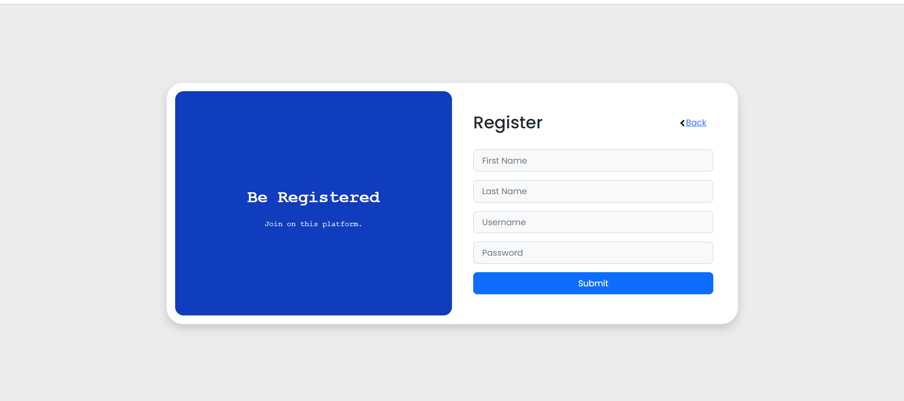
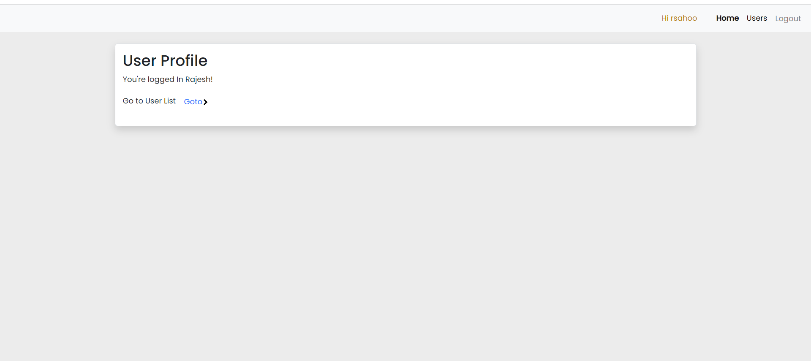
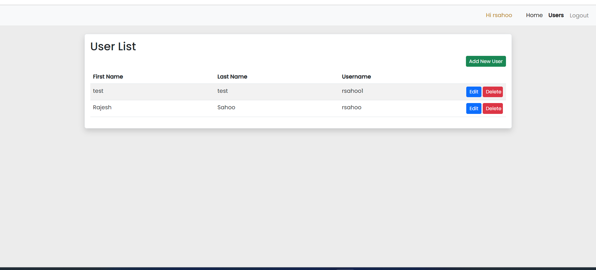
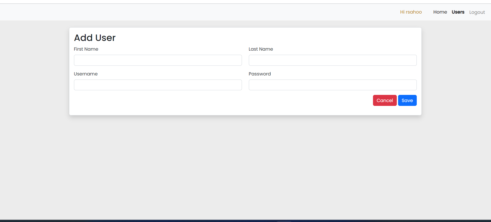
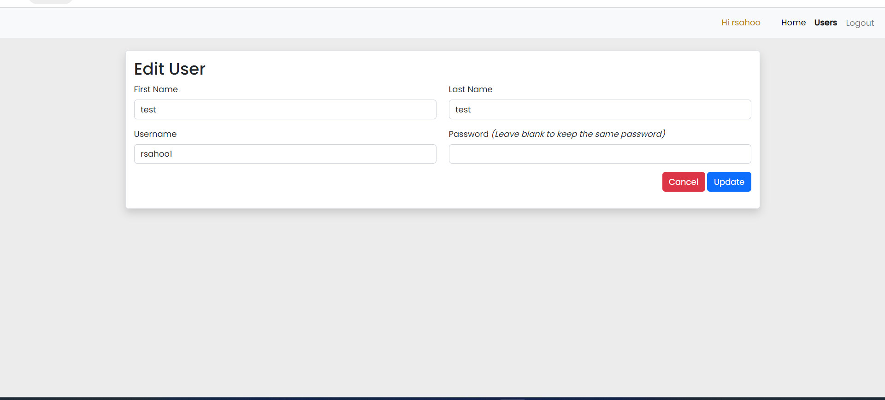

# Angular-User-Management-App

This project was generated with [Angular CLI](https://github.com/angular/angular-cli) version 16.0.0.

## Development server

Run `ng serve` for a dev server. Navigate to `http://localhost:4200/`. The application will automatically reload if you change any of the source files.

## Code scaffolding

Run `ng generate component component-name` to generate a new component. You can also use `ng generate directive|pipe|service|class|guard|interface|enum|module`.

## Build

Run `ng build` to build the project. The build artifacts will be stored in the `dist/` directory.
## Concept implemented

* Fake Backend API
* Feature Module(Lazy loading)
* JWT token
* Loader Interceptor

## Steps to Run the application 

* clone the repo from https://github.com/tocallrajesh/angular-crud-app.git
* Go to angular-crud-app directory
* Run npm install
* Run npm start
* Open http://localhost:4200/ on your browser
* Register a new user
* Login with new user credentials (username and password)

## Login page 

## Register page 

## Profile page 

## User List page

## Add New User page

## Edit User page

