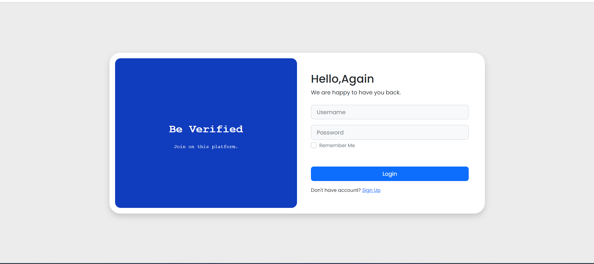

# Angular-Crud-App

This project was generated with [Angular CLI](https://github.com/angular/angular-cli) version 16.0.0.

## Development server

Run `ng serve` for a dev server. Navigate to `http://localhost:4200/`. The application will automatically reload if you change any of the source files.

## Code scaffolding

Run `ng generate component component-name` to generate a new component. You can also use `ng generate directive|pipe|service|class|guard|interface|enum|module`.

## Build

Run `ng build` to build the project. The build artifacts will be stored in the `dist/` directory.

## Running unit tests

Run `ng test` to execute the unit tests via [Karma](https://karma-runner.github.io).

## Running end-to-end tests

Run `ng e2e` to execute the end-to-end tests via a platform of your choice. To use this command, you need to first add a package that implements end-to-end testing capabilities.

## Steps to Run the application 

* clone the repo from https://github.com/tocallrajesh/angular-crud-app.git
* Go to angular-crud-app directory
* Run npm install
* Run npm start
* Open http://localhost:4200/ on your browser
* Resister a new user
* Login with new user username and password

## Login page 

## Register page 

## User List page 

## Add New User page

## Update User page

